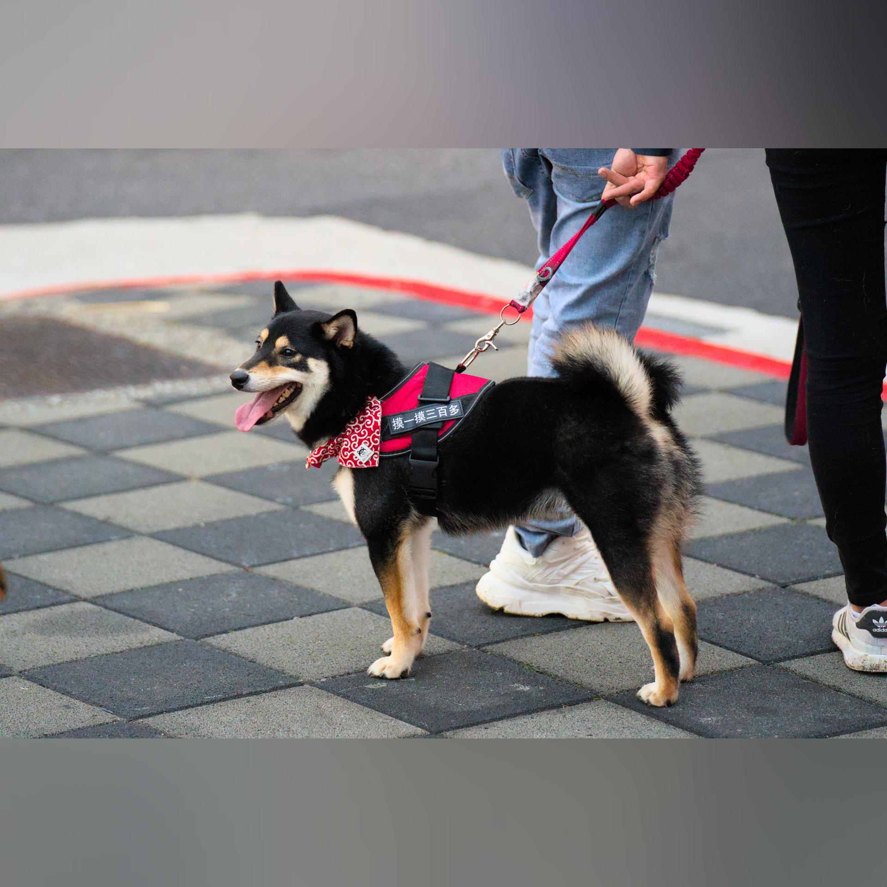
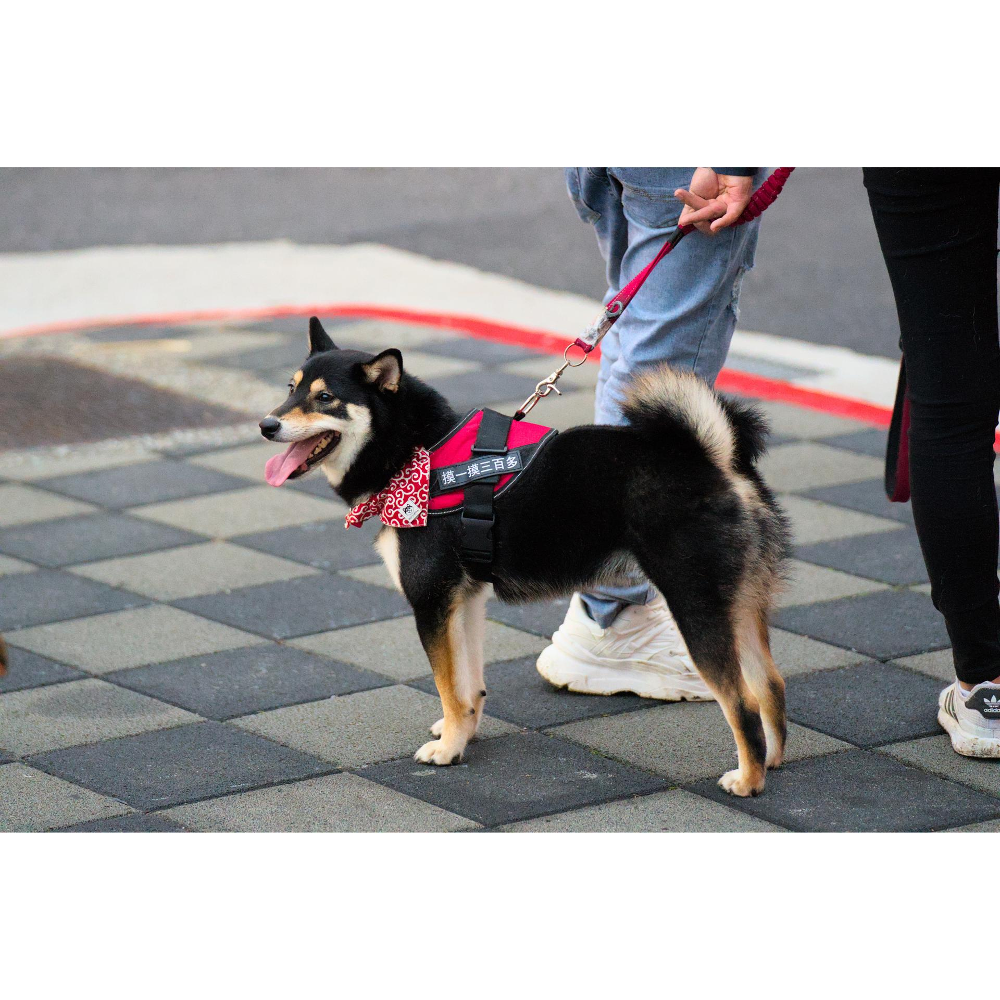
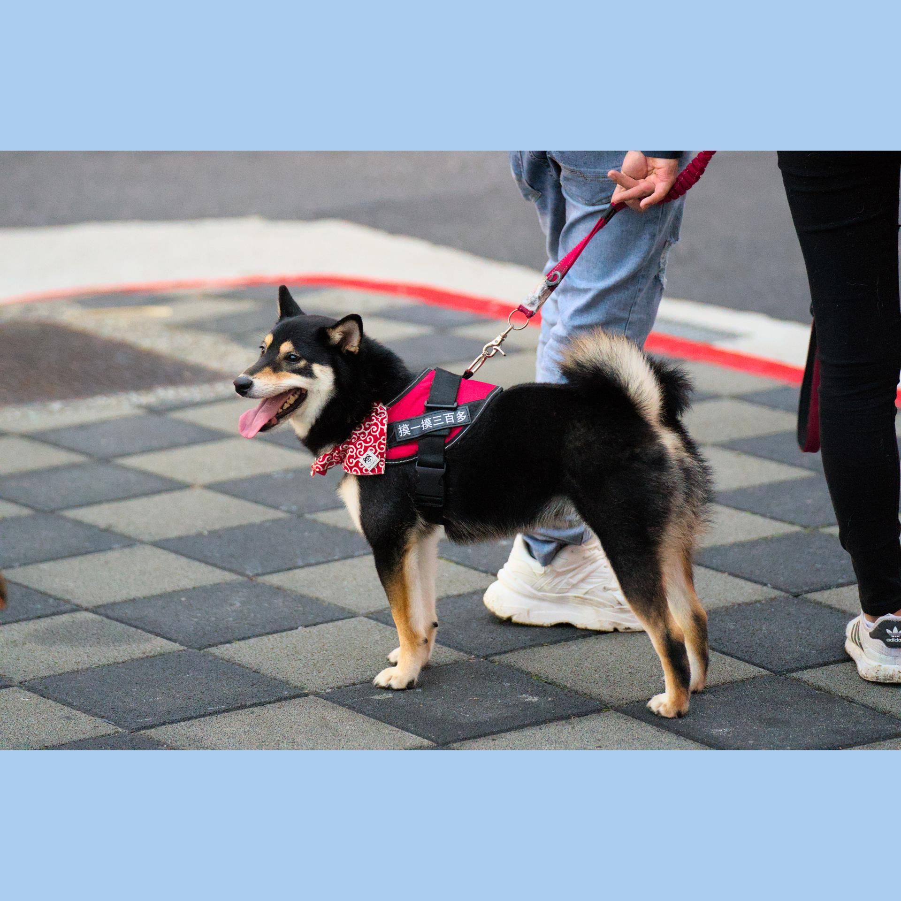

# Square Image

## TL;DR
I'm lazy and I don't want to download another App just to make my photos square. This script does all the magic for you.

|Original| Squared  |
|---|---|
|   |   |

### Single sample command
```
python3 src/main.py single \
    -i INPUT_IMG \
    -o OUTPUT_IMG \
    --fixed_output_resolution 1920 1920
```

### Batch sample command
```
python3 src/main.py batch \
    -i INPUT_DIR \
    -o OUTPUT_DIR \
    --fixed_output_resolution 1920 1920
```

## Features

### Methods
#### Blur (default)

- `-r/--blur_radius` - specify the radius used to blur the image.
    - default radius is 0.1
    - Can be either `int` or `float`:
        - `int`: define the radius
        - `float`: the radius is calculated by _max(width, height) * the ratio_

#### Single Color
- `-c/--color` - specify the color
    - default color is white
    - `str`: that is understandable by PIL. For example, `white`, `#ABCDEF`.

|White| #ABCDEF  |
|---|---|
|   |   |
